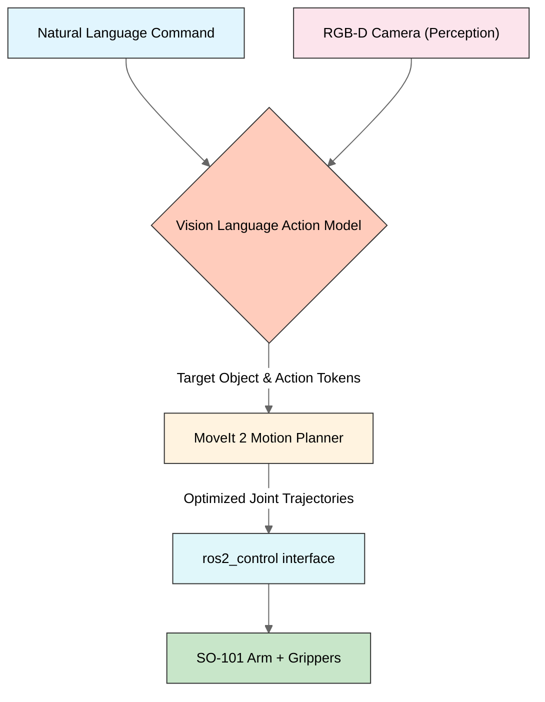

<div align="center">


  
  <h1>lang2pick</h1>
  
  <p>
    A language to action pipeline for so-101 manipulator 
  </p>
  
  
<!-- Badges -->
<p>
  <a href="https://github.com/shrujanus/lang2pick/graphs/contributors">
    
  </a>
  <a href="https://github.com/shrujanus/lang2pick/network/members">
    
  </a>
  <a href="https://github.com/shrujanus/lang2pick/stargazers">
    
  </a>
  <a href="https://github.com/shrujanus/lang2pick/issues/">
    
  </a>
  <a href="https://github.com/shrujanus/lang2pick/blob/master/LICENSE">
    
  </a>
</p>

   
<h4>
    <a href="https://github.com/shrujanus/lang2pick/tree/main/docs">View Demo</a>
  <span> · </span>
    <a href="https://github.com/shrujanus/lang2pick/tree/main/docs">Documentation</a>
  <span> · </span>
    <a href="https://github.com/shrujanus/lang2pick/issues">Report Bug</a>
  <span> · </span>
    <a href="https://github.com/shrujanus/lang2pick/issues">Request Feature</a>
  </h4>
</div>

<br />

## Inspiration

Growing up in India, I often saw plastic bottles, cans, wrappers, and recyclables littering the streets. It always felt like a **solvable problem**, what if only technology could lend a hand (literally)

This project was born from that simple idea:  
> **What if a robotic arm could autonomously identify and pick up recyclables, cleaning our environment, one object at a time?**

<div align="center">
  
</div>

lang2pick is a step toward that: by using an **open-source arm (SO-101)**  we then combines **natural language understanding**, **vision-language-action modes**, and **motion planning** to enable real-world pick-and-place tasks

## Overview

**SO-101 ROS2** is an experiment for building **general-purpose robotic manipulators** using the **SO-101 robotic arm**. It enables **natural language-driven pick-and-place** operations via a complete software stack:

> **Example Command:**  
> _“Pick up all recyclables and place them in the blue recycling bin”_

The system bridges the full pipeline:  
**Language → Perception → Action Planning → Hardware Execution**

### End Goal
Provide developers with a **plug-and-play platform** to:
- Fine-tune **Vision-Language-Action (VLA)** models
- Control **any ROS2-compatible robotic arm** via `ros2_control`
- Perform **robust pick-and-place** tasks in simulation and reality (sim-to-real)

## System Architecture



## 📝 To-Do List


- [x] Hardware interface for SO101 arm
- [x] Connect with MoveIt 2 planner 
  <div align="center">
    
  </div>
- [x] Write a modular Python framework for VLM object detection
- [x] Implement a gRPC server to send perception commands to the robot
- [x] Create a ROS 2 ↔ gRPC bridge
- [x] Stream the world-frame video using WebRTC
- [x] Build front-end to interact with VLM and display current picking status
- [ ] Automate deployment to the cloud


## Project Structure

| Directory | Description |
|------------|-------------|
| `ros2_ws/` | ROS2 workspace containing robot description, MoveIt2 configuration, controller setup, hardware interface nodes and simulation |
| `vla/` | Vision-Language(-Action) module — converts VLA outputs (object/action tokens) into ROS2 commands for MoveIt2 |
| `vla/src/web-app/` | Web application for controlling the robot via natural language commands |
| `vla/src/vision-pipeline/` | gRPC-based vision pipeline for object detection and pose estimation |
| `scripts/` | Training and fine-tuning pipeline for the Vision-Language model (using **PyTorch** and **LeRobot**) |
| `docs/` | Documentation, diagrams, and setup guides for developers and contributors |

---

## 🚀 Web Application Quick Start

The web application provides a modern interface to control the SO-101 arm using natural language commands, with live video feed, robot visualization, and task management.

### Prerequisites

- **Python 3.10+** with pip
- **Node.js 18+** with pnpm (or npm)
- **Git**

### 1. Clone the Repository

```bash
git clone https://github.com/vishnunomadpersonal/lang2pick_vla.git
cd lang2pick_vla
```

### 2. Start the Backend API Server

```bash
# Navigate to the web-app front-end directory
cd vla/src/web-app/front-end

# Install Python dependencies
pip install fastapi uvicorn websockets python-multipart grpcio aiohttp

# Start the backend server (simulation mode)
python rest_api_server.py --mode simulation
```

The backend will start on `http://localhost:8000`

**Backend modes:**
- `--mode simulation` — Demo mode with simulated robot (default)
- `--mode real` — Connect to actual ROS2 and hardware

### 3. Start the Frontend (New Terminal)

```bash
# Navigate to front-end directory
cd vla/src/web-app/front-end

# Install Node.js dependencies
pnpm install
# or: npm install

# Start development server
pnpm dev
# or: npm run dev
```

The frontend will start on `http://localhost:3000`

### 4. Access the Application

Open [http://localhost:3000](http://localhost:3000) in your browser.

**Features available:**
- 🎥 Live video feed (webcam or WebRTC)
- 🤖 Real-time robot arm visualization
- 💬 Natural language command input
- 📋 Task queue with progress tracking
- 📊 System status dashboard
- 🔄 Simulation/Real mode toggle

### Configuration

Edit `vla/src/web-app/front-end/.env.local` to customize:

```bash
NEXT_PUBLIC_API_URL=http://localhost:8000
NEXT_PUBLIC_WS_URL=ws://localhost:8000/ws
NEXT_PUBLIC_USE_SIMULATION=true
NEXT_PUBLIC_WEBRTC_ENABLED=false
```

### API Reference

| Method | Endpoint | Description |
|--------|----------|-------------|
| GET | `/api/status` | System status |
| POST | `/api/tasks` | Submit new task |
| GET | `/api/tasks` | List all tasks |
| GET | `/api/robot/joints` | Current joint state |
| POST | `/api/robot/home` | Move to home position |

For detailed API documentation, see [Web App README](vla/src/web-app/README.md).

---

## 🔧 Vision Pipeline (gRPC)

The vision pipeline provides object detection and pose estimation services via gRPC.

### Running the gRPC Server

```bash
cd vla/src/vision-pipeline

# Install requirements
pip install -r requirements-runpod.txt

# Run the gRPC server
python grpc_server.py
```

### Using the gRPC Client

```python
from grpc_client import VisionPipelineClient

client = VisionPipelineClient("localhost:50051")
result = client.detect_objects(image, prompt="red bottle")
```

---

## Tech Stack

- **ROS2 Humble** — Core robotics framework  
- **MoveIt2** — Inverse kinematics and motion planning  
- **PyTorch + LeRobot** — Vision-Language training & fine-tuning  
- **Gazebo / MuJoCo Sim** — Physics simulation and visualization
- **Next.js + TypeScript** — Modern web frontend  
- **FastAPI + Python** — Backend API with WebSocket support  
- **gRPC + Protocol Buffers** — High-performance vision pipeline communication  

## [Contributing](CONTRIBUTING.md)

Contributions are welcome! Whether you want to help with ROS2 development, dataset collection, or model training — feel free to open an issue or a PR.  


## License

This project is open-source and licensed under the [Apache License](LICENSE).

## Acknowledgements

This project builds on the shoulders of open-source giants —  
**MoveIt2**, **ROS2**, **PyTorch**, **LeRobot**, and the amazing open-source robotics community.
